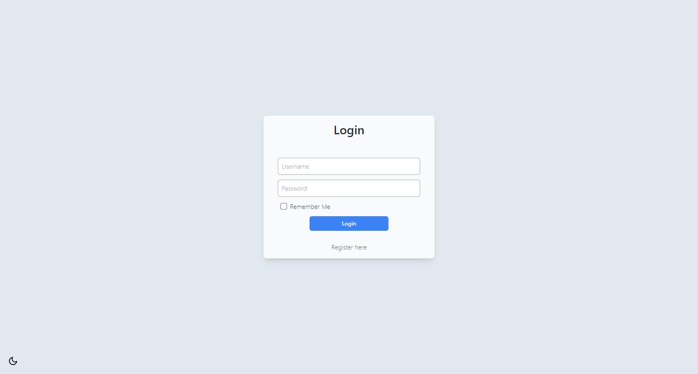
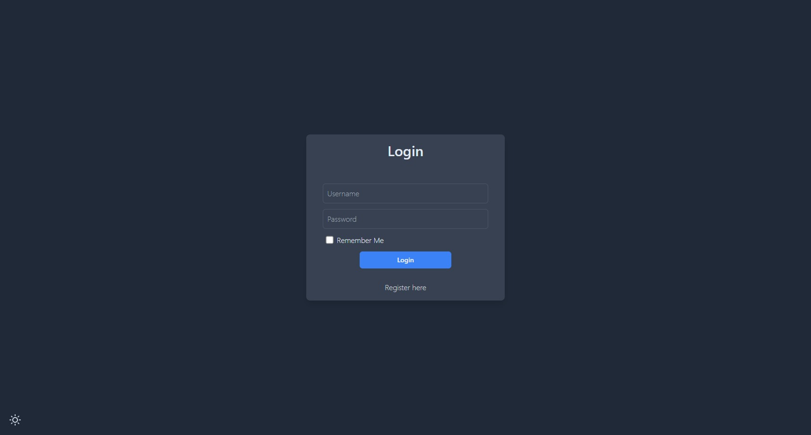
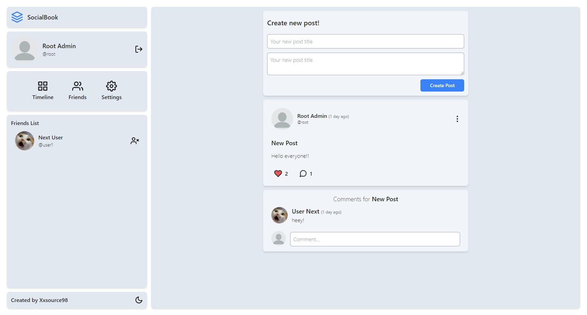
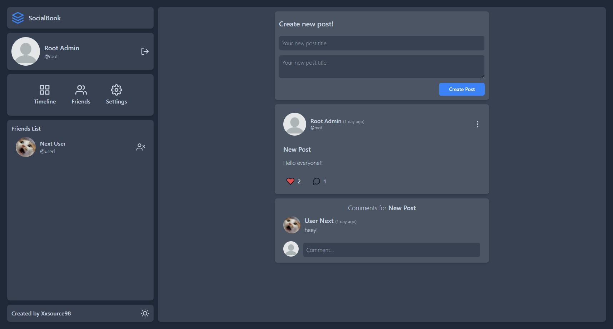
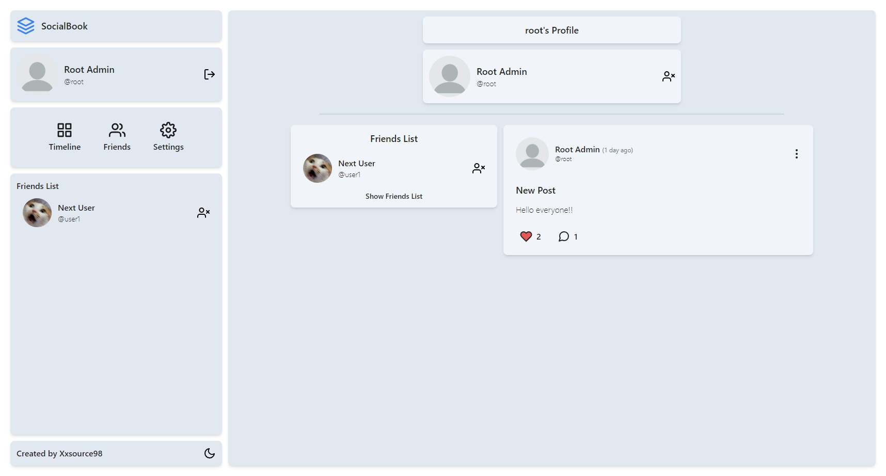
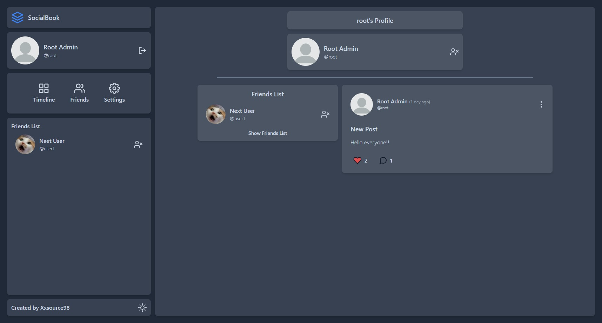
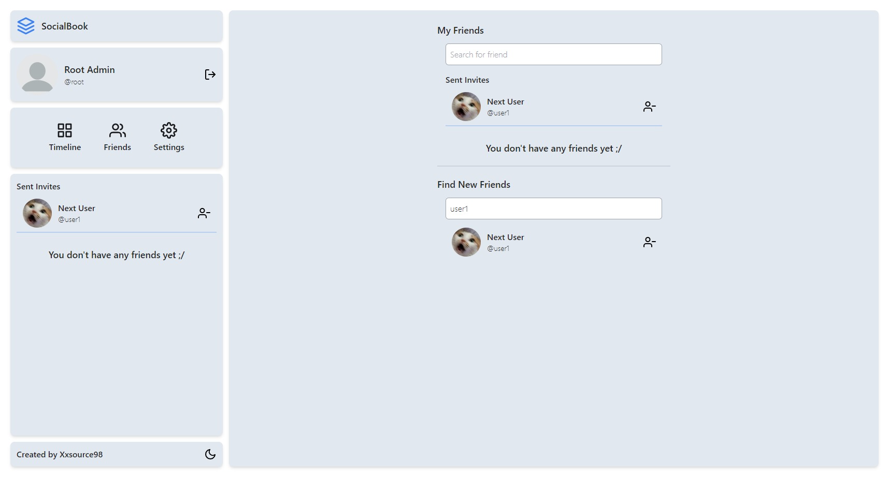
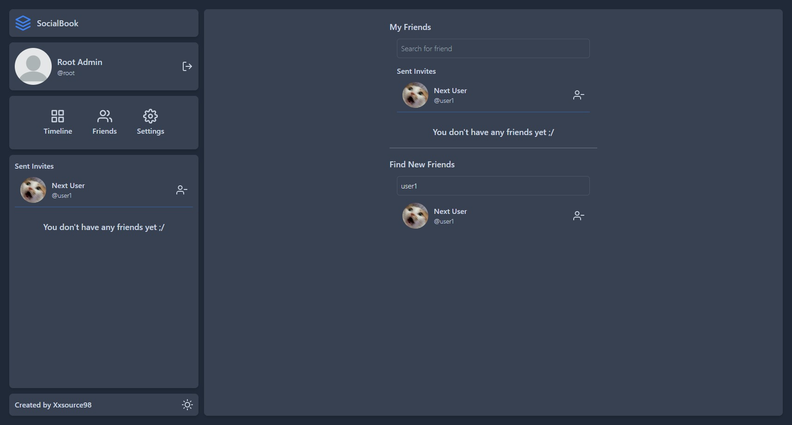
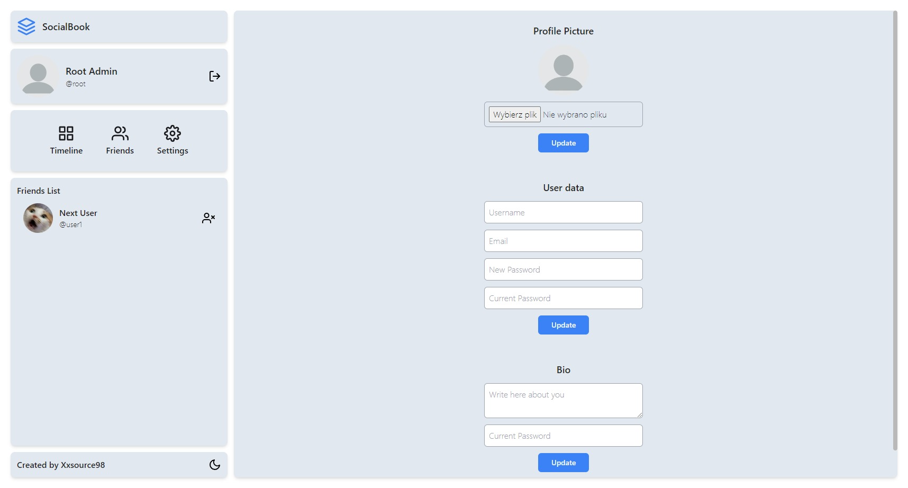
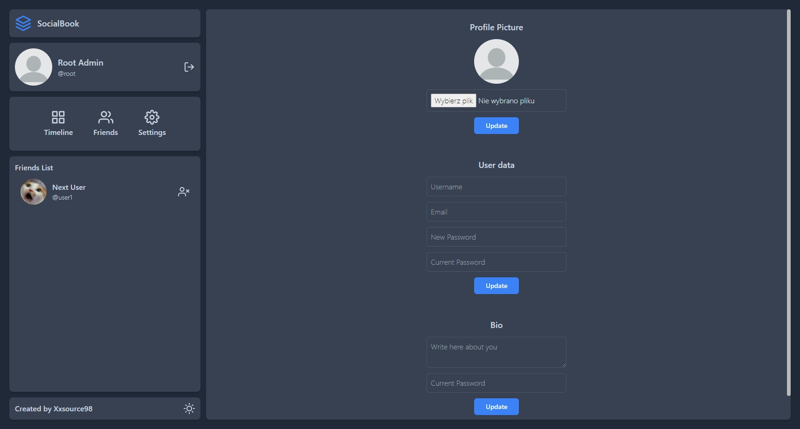

<h1><center>SocialBook - Social Page Project</center></h1>

## About Project
SocialBook is a social page type website built using Next JS, Express JS and MySQL. I made that project because I wanted to try something new and learn more from Backend functions, learn more from databases (SQL in this case), test my "Next JS skills" and how user authentication on pages like that works (I used JWT token for authenticate user).

## Functions
<ul>
    <li>Login/Register users (with JWT method)</li>
    <li>Create Posts</li>
    <li>Create Comments</li>
    <li>Like Posts</li>
    <li>Update User Info</li>
    <li>Add/Remove Users to Friends List</li>
</ul>

## How to build
Project is using Docker, so you have to use that one command to build and use it :)
```
docker-compose up --build
```

## Technologies used
<ul>
    <li>Frontend - React (Next JS)</li>
    <li>Backend - Express JS</li>
    <li>Database - MySQL</li>
</ul>

## Images
<table style="text-align:center;">
    <thead>
        <th>
            <h4>Light</h4>
        </th>
         <th>
            <h4>Dark</h3>
        </th>
    </thead>
    <tbody>
        <tr>
            <td>
                
            </td>
            <td>
                
            </td>
        </tr>
        <tr>
            <td>
                
            </td>
            <td>
                
            </td>
        </tr>
        <tr>
            <td>
                
            </td>
            <td>
                
            </td>
        </tr>
        <tr>
            <td>
                
            </td>
            <td>
                
            </td>
        </tr>
        <tr>
            <td>
                
            </td>
            <td>
                
            </td>
        </tr>
    </tbody>
</table>

## License
This project is under MIT License. More information you can read from LICENSE file.